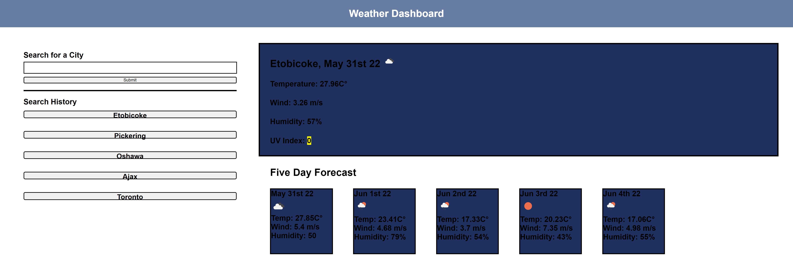

# Server Side APIs: Weather Dashboard

## Link

## Description

The purpose of this project is to create a weather dashboard using HTML & CSS, powered by javascript.  The dashboard is to utilize a server side API provided by Open Weather.  It will display the weather conditions for today's date on a main weather card.  The five day forecast for that location will also be displayed on five smaller cards below.   

## Steps Taken

1.  Created a skeleton HTML layout for the page, utilizing divs and flex boxes to align content where needed.  Applied minor CSS styling to layout.

2.  Aqquried an API key from open weather and set up a test fetch request.  Was able to get most values, but needed to create another fetch request at a different address to aquire a few more.

3.  Saved all variables needed and used j.query to append text values to html sheet

4.  Added an event listner on the submit 'click' to execute the above function.  

5.  Added an array to keep track of the search history.  Implemented a loop in the event listener to update the matrix each time a new entry is added.

6.  Created a function to check if a valid entry is entered in the event listener.  If not, the function will not run.

7.  Added feature to save search history in local storage, and display it on page load.

8.  Completed CSS styling and removed any borders used as guidelines

## Pictures of Website

